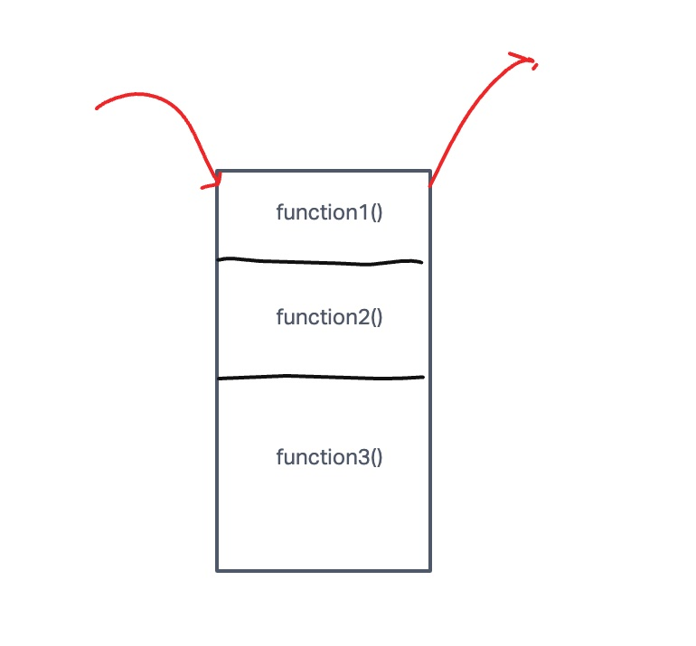

# Class 10 Reading Notes

These readings cover the call stack and LIFO.  The second reading covers some common error types in JS and what they mean.  It also reviews how to use the debugger.

## Understanding the Javascript Call Stack

- What is a ‘call’?

> A call is a function invocation.

- How many ‘calls’ can happen at once?

> Calls happen one at a time in JS.

- What does LIFO mean?

> LIFO means last in, first out.  It  means the last function that gest pushed to the stack is the first to pop out when the function returns.

- Draw an example of a call stack and the functions that would need to be invoked to - generate that call stack.

> 
> `function function3(){  
     function2();  
}  
function funtion2(){  
  function1();  
}  
function3();`

- What causes a Stack Overflow?

> Stack Overflow happens when there is a recursive function that doesn't have an exit point.  If the calls on the stack exceeds the browser limit it will throw a stack error.

## JavaScript Error Messages

- What is a ‘reference error’?

> A reference error is when you try to use a variable that has not been delared yet.

- What is a ‘syntax error’?

> Syntax errors occur when soomething can not be parsed because of the snytax.

- What is a ‘range error’?

> A range error happens when you manipulate an object with some length and give it an invalid length.

- What is a ‘type error’?

> Type errors are when you use some method or property that is incompatible with the data type.

- What is a breakpoint?

> Breakpoints are places where we want our code to stop executing during debugging.

- What does the word ‘debugger’ do in your code?

> It sets a breakpoing in the code if it is included directly.

## Things I want to know more about

- How much memory do common browsers have for function execution.
