# SQL and Relational Databases

## My Notes

Relational databases are organized into tables with predefined relationships between them.  Each table consists of rows and columns allowing for structured storage and retrieval of data.  SQL is the language used to manage, query, and manipulate the relational databases.  Common operations include Selecting, Inserting, Updating, and Deleting records or full tables.  Additionally, the relationships between the tables allow for more complex queries that join the data from multiple tables in order to answer specific questions.  The syntax of SQL can be used across a number of different database management programs like SQLlite, Postgres, and Oracle.

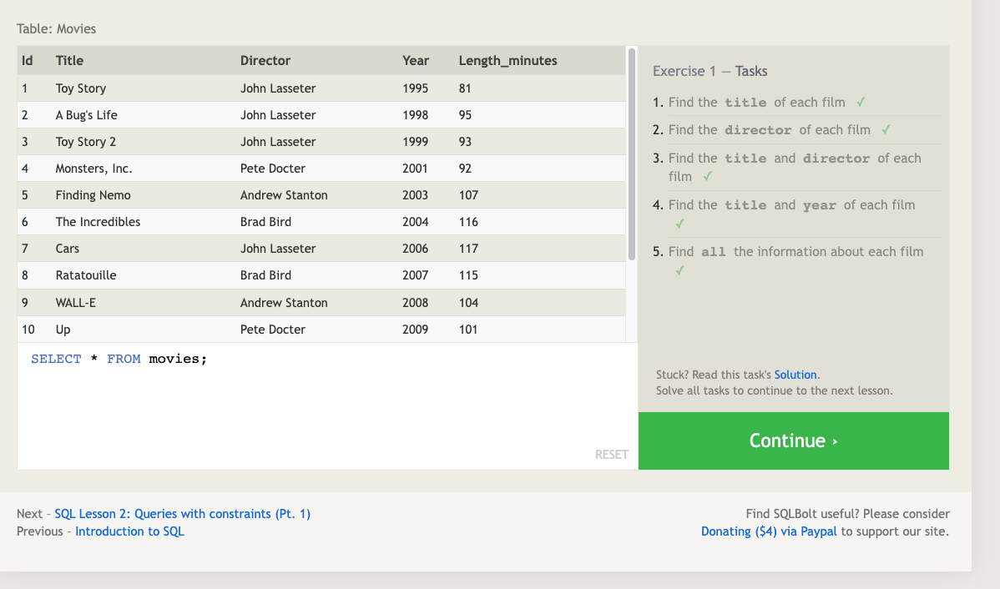
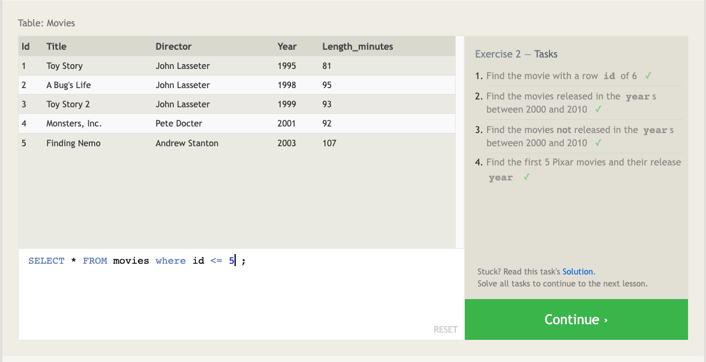
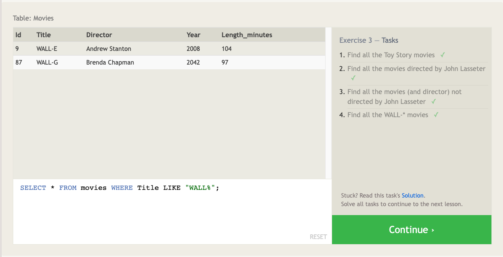
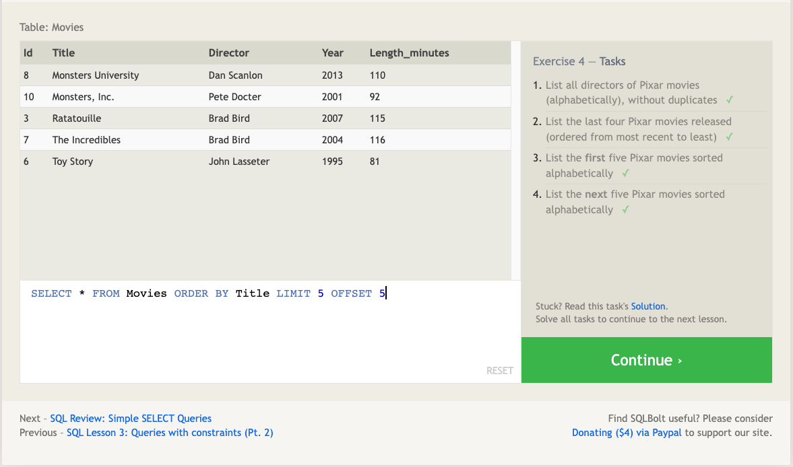
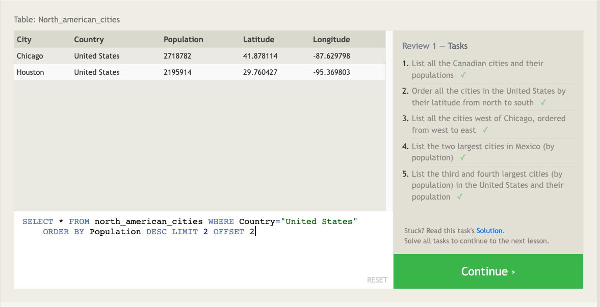
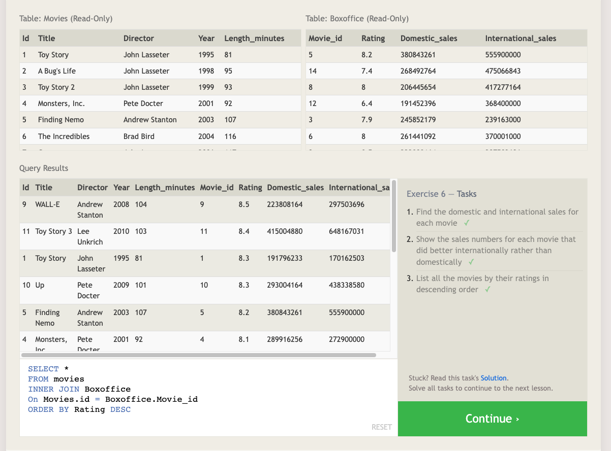
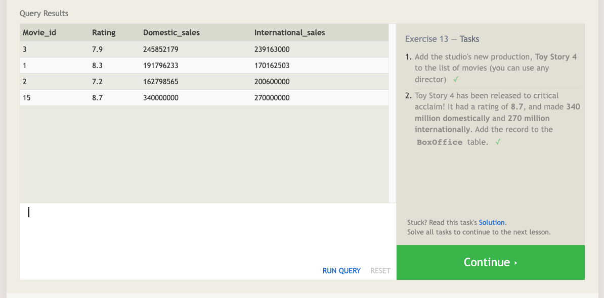
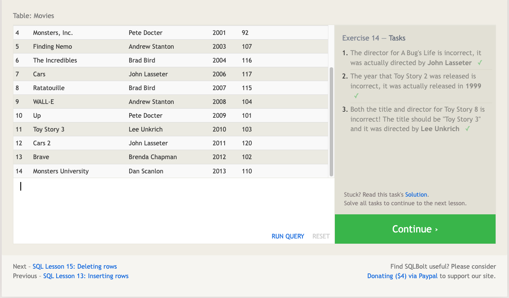
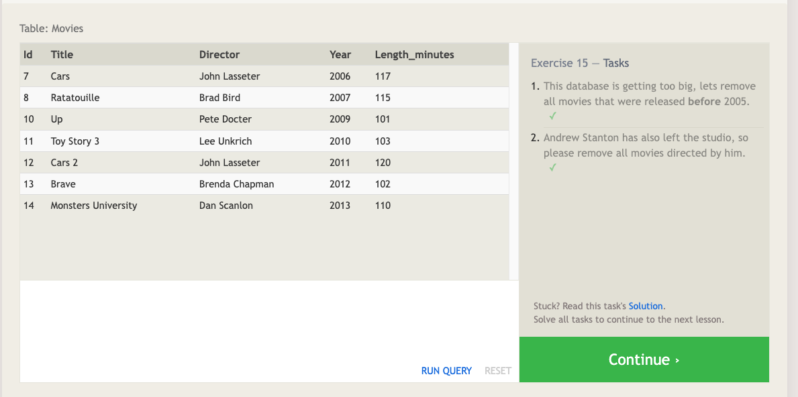
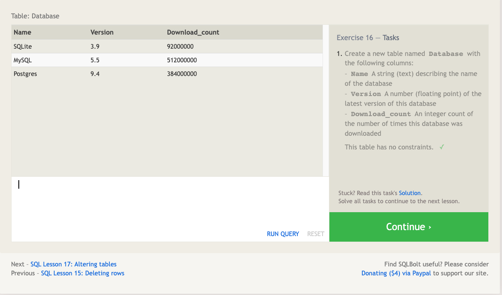
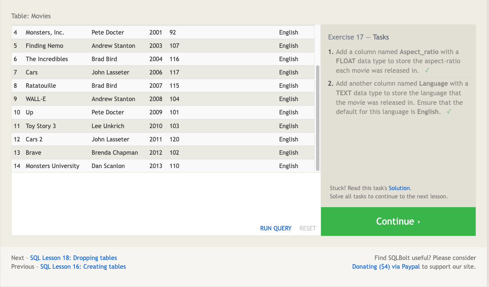
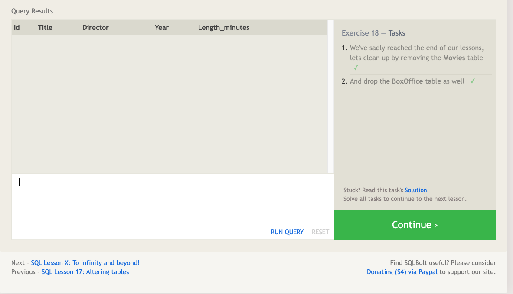
